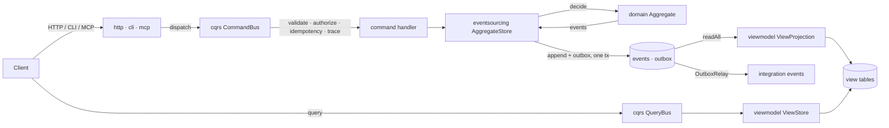
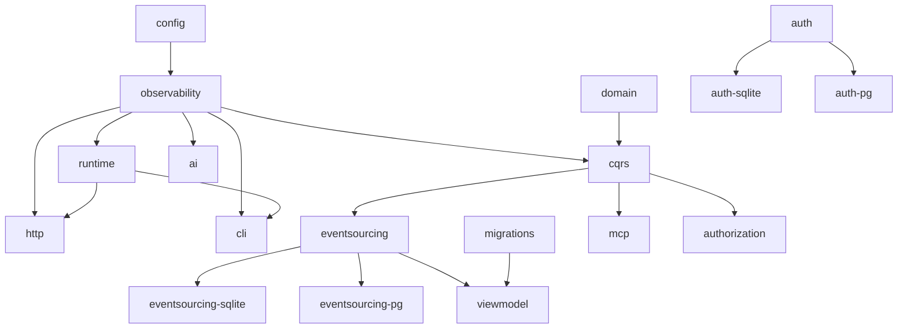

# Architecture

How the `@structure-ai/*` packages compose into an application, and the rules the composition obeys. Package-level APIs live in each package's README; this document owns the cross-package picture.

## The flow of a command

- The **edge** (`http`, `cli`, `mcp`) translates transport concerns and dispatches; it holds no business logic.
- The **bus** (`cqrs`) owns boundary validation (shape), authorization of the action, idempotency keys, tracing/metrics. Business rules live one step deeper.
- **Authorization** (`authorization`) is a typed policy value (roles × `resource:action` permissions, conditional grants, scoped roles) checked against the `Principal` attached to the fiber; the bus `Authorizer` and HTTP guards are adapters over it. It fails closed and distinguishes `Unauthenticated` (401) from `PermissionDenied` (403).
- The **aggregate** (`domain`) is a pure decider: `decide` accepts/rejects, `evolve` folds. The same definition serves state-stored and event-sourced persistence.
- The **aggregate store** (`eventsourcing`) enforces optimistic concurrency (`expectedVersion` append) and stamps event metadata (correlation/causation).
- **Read models** (`viewmodel`) are hydrated asynchronously by projections; queries only ever read them.
- **Cross-context effects** leave through the transactional **outbox**; consumers are made idempotent by the **inbox**.

## Dependency direction

No cycles; `migrations` and `auth` are standalone foundations (`auth` depends only on Effect), while the auth SQL adapters depend on `auth` and Bun's built-in database clients. `ai`, `mcp`, `playwright` and `authorization` are leaves (`http`/`mcp` never depend on `authorization` — applications compose its guards with their endpoints and tools; `authorization` never depends on `auth` — applications turn an authenticated session into a `Principal`). Auth applications inject tenant configuration, persistence, mail, audit, rate limits, and external HTTP at composition time rather than coupling authentication to another context's tables. A PR that needs to violate this direction is redesigning the system and needs an ADR.

## Authentication boundary

`@structure-ai/auth` owns credentials, external identities, verification tokens, WebAuthn challenges/passkeys, and opaque sessions. Tenant ID participates in every uniqueness and lookup key. Applications own profile data and authorization decisions; they refer to the authenticated user ID instead of reading or extending auth storage directly.

Durable `AuthStore` implementations preserve the package's atomic commands: identity creation with uniqueness, one-time consumption, password replacement with session revocation, and passkey counter advancement. `auth-sqlite` and `auth-pg` implement that contract with Bun-native SQL, tenant-leading keys, transactions, and compare-and-set updates. Account linking is an explicit application policy and defaults to denied—even when a provider reports the same verified email.

## Consistency model

- **Strong** inside one aggregate transaction: `append(stream, expectedVersion, events)` either wins or fails `ConcurrencyConflict` (retryable via `executeWithRetry`).
- **Eventual** everywhere else: view models converge via checkpointed, at-least-once projections; integration effects converge via outbox relay + inbox dedup. Exactly-once *business effects* come from expected-version appends and idempotency keys, never from a transport guarantee.
- Read-your-own-write: return the command ack (id + version) and poll the view for that version — nothing pretends projections are synchronous.

## Error taxonomy

Every framework error is a `Data.TaggedError` carrying `classification`:

| Classification | Meaning | Retry? | Edge mapping (http/cli) |
| --- | --- | --- | --- |
| `transient` | Timeouts, throttling, transport | Yes, bounded backoff + jitter | 504 / exit 75 |
| `permanent` | Validation, invariants, not-found, authn/authz | Never | 400/401/403/404 / exit 1 |
| `conflict` | Optimistic concurrency lost | Reload then retry the whole command | 409 / exit 1 |
| declared business failure | A command/query's declared `failure` schema | Never (caller decides) | 422, `_tag`-discriminated body |

The classification is decided where the error is born and preserved across layers — retry policies, HTTP status mapping, and CLI exit codes all read it instead of guessing from error types.

## Where each concern is handled exactly once

| Concern | Owner |
| --- | --- |
| Config validation (all errors at once, fail before work) | `config` at startup, via `runtime` |
| Correlation ids on logs + spans | `observability` (`Correlation`), injected at the edge |
| Traffic/error/latency metrics per boundary | `Metrics.track` at bus, HTTP, AI call sites |
| Retries | One owner per operation: `executeWithRetry` (conflicts), `OutboxRelay` (publishing), `ai` (transient LLM failures), `client` (transport, for typed API calls). Never nested. |
| Secrets | `Redacted` from `Settings.secret` to call site; never logged |
